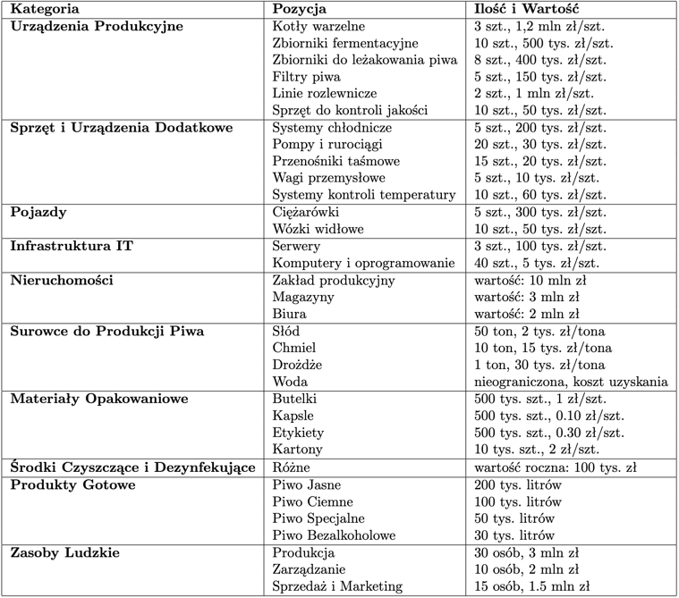
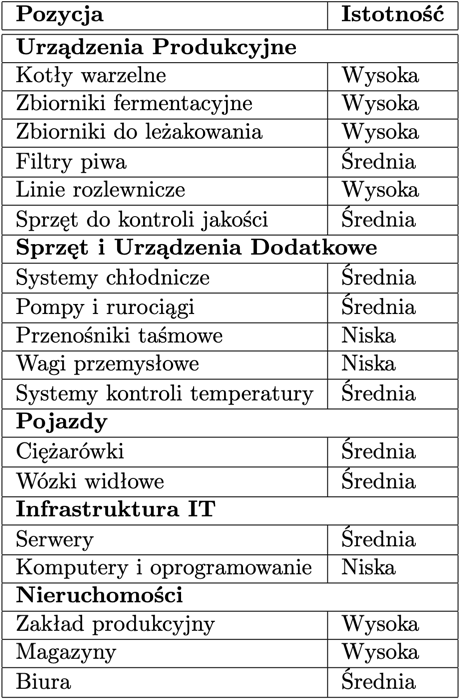

<!-- _paginate: skip -->
<!-- _header: '' -->
<!-- _footer: '' -->
<!-- _class: lead -->

# **_PiwowareX_ – Polityka Bezpieczeństwa**

Michał Tułowiecki, Tomasz Mycielski

---

# **Cel i adresaci polityki bezpieczeństwa**

**Cel**: Zaprezentowanie polityki bezpieczeństwa firmy PiwowareX.

**Adresaci**: Pracownicy i kontrahenci firmy PiwowareX.

**Zobowiązania**: Pracownicy muszą zapoznać się i przestrzegać zasad; dla kontrahentów polityka służy jako informator o standardach bezpieczeństwa.

---

# **Odpowiedzialne Osoby**

|                   Rola                    |   Imię i Nazwisko   |
|:-----------------------------------------:|:-------------------:|
|                   CISO                    |   Tomasz Krawczyk   |
|     Kierownik ds. Ciągłości Działania     |    Jan Kowalski     |
|     Specjalista ds. Bezpieczeństwa IT     |     Anna Nowak      |
|  Koordynator ds. Zarządzania Kryzysowego  |  Michał Wiśniewski  |
|            Dyrektor Operacyjny            |       Ewa Maj       |

---

# **CISO**

Główną osobą odpowiedzialną za politykę bezpieczeństwa jest CISO (Chief Information Security Officer), powoływany przez zarząd firmy.
W razie nieobecności CISO, lub jego niezdolności do pracy, obowiązki przejmowane są przez wyznaczonego specjalistę ds. bezpieczeństwa IT.

<!--
Głównym strażnikiem bezpieczeństwa jest CISO
-->

---

# **Obowiązki CISO**

- Opracowywanie i monitorowanie polityk
- Nadzór nad standardami bezpieczeństwa
- Reakcja na incydenty o wysokim priorytecie
- Raportowanie do zarządu

<!--
Zakres Obowiązków: Opracowywanie i monitorowanie polityk, nadzór nad standardami bezpieczeństwa, reakcja na incydenty o wysokim priorytecie, raportowanie do zarządu.
Ma Nadzór przez zarząd firmy i radę nadzorczą
-->

---
<!-- _class: lead -->

# **Polityki zarządzania aktywami**

---

# **Skala wartości aktywów**

1. Bardzo duża
2. Znacząca
3. Średnia
4. Pomijalna

<!--
Skala wartości aktywów według ISO 27005

Bardzo duża -- strata lub awaria tych aktywów powoduje natychmiastowe przerwanie procesów biznesowych
Znacząca -- strata lub awaria tych aktywów może spowodować przerwanie procesów biznesowych
średnia -- strata lub awaria tych aktywów powoduje utrudnienia w funkcjonowaniu przedsiębiorstwa
Pomijalna -- strata lub awaria tych aktywów nie ma wpływu na funkcjonowanie przedsiębiorstwa, lub jej wpływ jest pomijalnie mały 
-->

--- 

# **Aktywa o bardzo dużej istotności**

- Inwentaryzacja co kwartał
- Analiza ryzyka
- Kontrolowany dostęp przez CISO
- Zabezpieczenia kryptograficzne
- Redundancja backupów
- Zabezpieczenia przed czynnikami naturalnymi

<!--
Procedury dla aktywów o bardzo dużej istotności
Inwentaryzacja aktywów co kwartał
Analiza ryzyka dla aktywów przeprowadzana przy inwentaryzacji
Dostęp do aktywów przyznawany jest przez CISO
Dostęp do aktywów przyznawany jest maksymalnie na kwartał
Dla każdego z aktywów zdefiniowana jest maksymalna liczba osób, które mogą mieć jednoczesny do niego dostęp
Utrzymywane są aktualne listy dostępowe, aktualizowane przy każdym przyznaniu, lub odebraniu, dostępu do aktywów
W przypadku aktywów cyfrowych stosowane są zabezpieczenia kryptograficzne oraz redundancja backupów, które to wykonywane są cyklicznie, nie rzadziej niż raz w tygodniu
Aktywa przechowywane w sposób uniemożliwiający nieautoryzowany dostęp, oraz minimalizujący możliwość wystąpienia awarii w wyniku czynników naturalnych
-->

---

# **Aktywa o znaczącej istotności**

- Inwentaryzacja co pół roku z analizą ryzyka.
- Przechowywanie bez wymogu ochrony przed czynnikami naturalnymi.
- Dostęp kontrolowany przez właścicieli biznesowych.

<!--
Inwentaryzacja aktywów wykonywana co pół roku
Przy inwentaryzacji przeprowadzana analiza ryzyka
Przechowywanie aktywów w sposób uniemożliwiający dostęp osób nieupoważnionych, minimalizowanie możliwości wystąpienia awarii w wyniku czynników naturalnych nie jest obowiązkowe
Dostęp do aktywów przyznawany jest przez ich właścicieli biznesowych
-->

---

# **Aktywa o średniej istotności**

- Rocznia inwentaryzacja i ocena ryzyka.
- Dostęp ogólny dla potrzebujących pracowników.
- Kopie zapasowe tworzone według uznania operatora.

<!--
- Inwentaryzacja i ocena ryzyka przeprowadzana raz na rok
- Dostęp przyznawany domyślnie wszystkim osobom, których rola w organizacji może wymagać tego dostępu
- Kopie zapasowe tworzone manualnie, gdy operator tworzący lub modyfikujący aktywa uzna to za słuszne
-->

---

# **Aktywa o pomijalnej istotności**

Brak specjalnych zabezpieczeń z uwagi na niską wartość dla potencjalnych zagrożeń.

---

<!-- _class: lead -->

# **Polityka zarządzania ryzykiem**

---

# **Inwentaryzacja**

---

# **Wycena aktywów**

---

# **Analiza zagrożeń**

Kilka kluczowych obszarów zagrożeń:

- Zagrożenia Technologiczne
- Zagrożenia Cybernetyczne
- Zagrożenia Ludzkie
- Zagrożenia Fizyczne
- Zagrożenia Środowiskowe i Prawne

<!--
- Zagrożenia Technologiczne: Awarie oprogramowania i sprzętu stanowią znaczne ryzyko, potencjalnie prowadząc do przestojów i zakłóceń w pracy.
- Zagrożenia Cybernetyczne: Ataki hakerskie, w tym potencjalne naruszenia bezpieczeństwa danych, są poważnym zagrożeniem, wymagającym skutecznych środków ochrony.
- Zagrożenia Ludzkie: Błędy pracowników i wycieki informacji mogą powodować straty danych lub ich niewłaściwe wykorzystanie.
- Zagrożenia Fizyczne: Pożary i inne katastrofy naturalne mogą mieć poważny wpływ na infrastrukturę firmy.
- Zagrożenia Środowiskowe i Prawne: Zmiany klimatyczne i niespełnienie wymogów regulacyjnych stanowią ryzyko dla stabilności i zgodności działalności firmy z przepisami.
-->

---

# **Polityka zarządzania dostępem i bezpieczeństwem fizycznym**

- Środki bezpieczeństwa w budynkach firmy
- Kontrola dostępu i bezpieczeństwo w biurze i zakładzie produkcyjnym
- Polityka czystego biurka

---

# **Polityka Bezpieczeństwa Operacyjnego i Zarządzania Incydentami Cyberbezpieczeństwa**

- Wrażliwe dane i zagrożenia dla nich
- Polityka zarządzania incydentami
- Współpraca z MSSP i SLA

---

# **Dziękujemy za uwagę**

- [ISO/IEC 27005:2022](https://www.iso.org/standard/80585.html)
- [NIST Cybersecurity Framework](https://www.nist.gov/cyberframework)
- [RODO](https://uodo.gov.pl/404)

